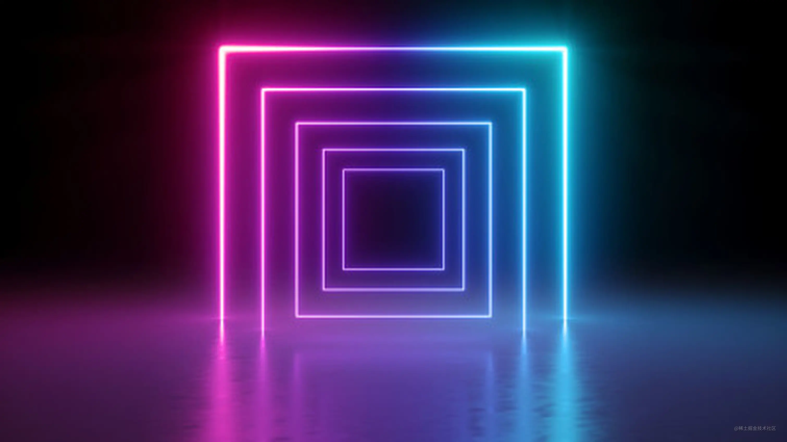
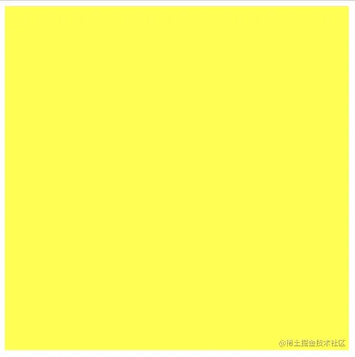
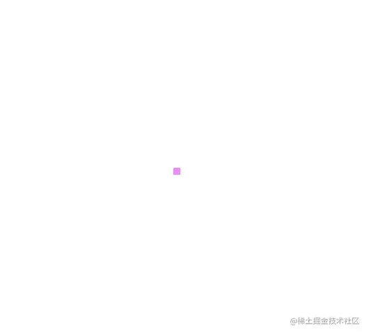
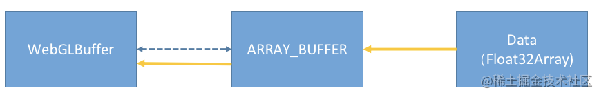
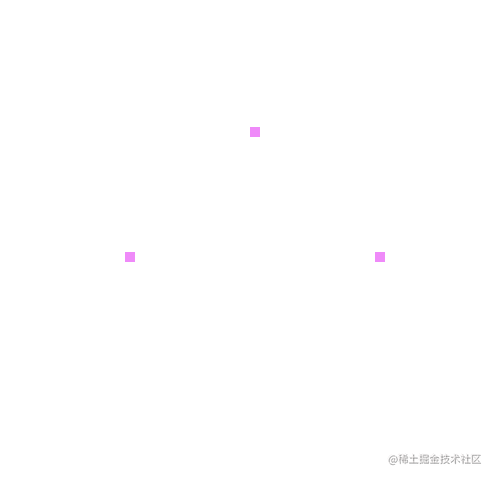
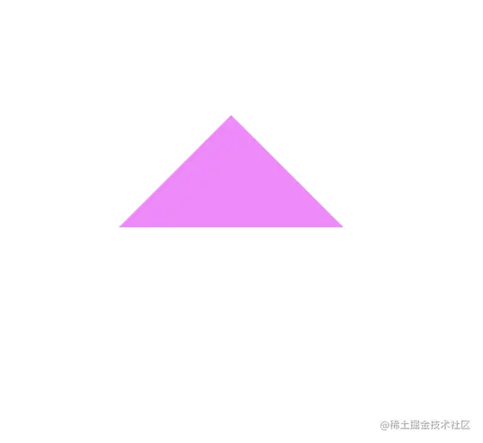

# WebGL 实战（一）—— 绘制三角形


传送门：

[WebGL 核心原理概述](../1-webgl-introduction/)

## 前言

之前我们讲过了 WebGL 的相关原理，我们了解到 WebGL 绘图的方式是“连接式”的，WebGL 就像是一个巨大的电路图，我们修改电路中的电路的连接方式或者是增加其中的电气元件，当我们按下开关时，这个电路就会自动运行。今天，我们就进入实战阶段，一切从 0 开始，手把手的带你使用原生的 WebGL 做一些有趣的事情。现在，我们需要从最基础的部分开始，除了 WebGL 的相关知识，我们也会穿插一些必要的图形学知识。从原生 WebGL 和图形学知识学起，就一个字：稳！

## 实战

WebGL 是一种 JavaScript API，用于在不使用插件的情况下在任何兼容的网页浏览器中呈现交互式 2D 和 3D 图形。WebGL 完全集成到浏览器的所有网页标准中，可将影像处理和效果的 GPU 加速使用方式当做网页 Canvas 的一部分。WebGL 元素可以加入其他 HTML 元素之中并与网页或网页背景的其他部分混合。WebGL 程序由 JavaScript 编写的句柄和 OpenGL Shading Language（GLSL）编写的着色器代码组成，该语言类似于 C 或 C++，并在电脑的图形处理器（GPU）上运行。

WebGL 基于 HTML5 Canvas，所以我们需要使用 Canvas 作为载体。在通过`getContext`方法来获取 WebGL 上下文。

```html
<!DOCTYPE html>
<html lang="en">
    <head>
        <meta charset="UTF-8" />
        <meta name="viewport" content="width=device-width, initial-scale=1.0" />
        <title>Drawing Triangle</title>
    </head>
    <body>
        <canvas id="canvas" width="500" height="500"></canvas>
    </body>
    <script src="1.js"></script>
</html>
```

```js
/**
 * @type {HTMLCanvasElement}
 */
const canvas = document.getElementById('canvas');
const gl = canvas.getContext('webgl');
```

## 最简单的 WebGL 绘制程序

现在让我们开始编写一个最简单的 WebGL 程序：

```js
/**
 * @type {HTMLCanvasElement}
 */
const canvas = document.getElementById('canvas');
const gl = canvas.getContext('webgl');

// 设置清空颜色缓冲区时的颜色
gl.clearColor(1.0, 1.0, 0.0, 1.0);

// 清空颜色缓冲区
gl.clear(gl.COLOR_BUFFER_BIT);
```

效果如下，我们得到的就是一张黄色的图。`gl.clearColor`中接受 RGBA 四个值，这里需要注意，RGBA 的值不是 0 ～ 255，而是 0 ～ 1，这一点需要注意下。



以上就是一个最简单的 WebGL 程序了。

## 渐入佳境

我们已经完成了一个最简单的 WebGL 程序，可能你还没有什么感觉，现在我们开始编写稍微复杂一点的程序，我们要开始使用着色器了。

### 初始化 Shader

着色器(shader)分为顶点着色器(vertex shader)和片元着色器（fragment shader），它们总是两两成对出现，顶点着色器和片元着色器组成了一个`WebGLProgram`，我们使用哪一个 shader，就是使用哪一个 `WebGLProgram`。使用 shader 的步骤如下：

1. 创建 Shader
    - 创建 `WebGLShader` 对象
    - 往 `WebGLShader`对象中传入 shader 源代码
    - 编译 shader
2. 创建 Program
    - 创建 `WebGLProgram`对象
    - 往 `WebGLProgram`对象中传入之前创建的 `WebGLShader`对象
    - 链接 program

代码如下：

```js
/**
 *
 * @param {WebGLRenderingContext} gl
 * @param {string} type
 * @param {string} source
 */
function createShader(gl, type, source) {
    // 创建 shader 对象
    let shader = gl.createShader(type);
    // 往 shader 中传入源代码
    gl.shaderSource(shader, source);
    // 编译 shader
    gl.compileShader(shader);
    // 判断 shader 是否编译成功
    let success = gl.getShaderParameter(shader, gl.COMPILE_STATUS);
    if (success) {
        return shader;
    }
    // 如果编译失败，则打印错误信息
    console.log(gl.getShaderInfoLog(shader));
    gl.deleteShader(shader);
}

/**
 *
 * @param {WebGLRenderingContext} gl
 * @param {WebGLShader} vertexShader
 * @param {WebGLShader} fragmentShader
 */
function createProgram(gl, vertexShader, fragmentShader) {
    // 创建 program 对象
    let program = gl.createProgram();
    // 往 program 对象中传入 WebGLShader 对象
    gl.attachShader(program, vertexShader);
    gl.attachShader(program, fragmentShader);
    // 链接 program
    gl.linkProgram(program);
    // 判断 program 是否链接成功
    let success = gl.getProgramParameter(program, gl.LINK_STATUS);
    if (success) {
        return program;
    }
    // 如果 program 链接失败，则打印错误信息
    console.log(gl.getProgramInfoLog(program));
    gl.deleteProgram(program);
}

/**
 *
 * @param {WebGLRenderingContext} gl
 * @param {string} vertexSource
 * @param {string} fragmentSource
 */
function initWebGL(gl, vertexSource, fragmentSource) {
    // 根据源代码创建顶点着色器
    let vertexShader = createShader(gl, gl.VERTEX_SHADER, vertexSource);
    // 根据源代码创建片元着色器
    let fragmentShader = createShader(gl, gl.FRAGMENT_SHADER, fragmentSource);
    // 创建 WebGLProgram 程序
    let program = createProgram(gl, vertexShader, fragmentShader);
    return program;
}
```

以上的三个函数就是我们的工具函数了，我们初始化 shader 都会用到上面的三个函数。

### 编写 Shader 程序

现在让我们开始编写 shader 程序吧。我们的目标是要在屏幕上显示一个点。

顶点着色器程序如下：

```js
// 顶点着色器
const vertexShader = `
    attribute vec4 a_position;
    void main () {
        // gl_Position为内置变量，表示当前点的位置
        gl_Position = a_position;
        // gl_Position为内置变量，表示当前点的大小，为浮点类型，如果赋值是整数类型会报错
        gl_PointSize = 10.0;
    }  
`;
// 片元着色器
const fragmentShader = `
    // 设置浮点数精度
    precision mediump float;
    void main () {
        // vec4是表示四维向量，这里用来表示RGBA的值[0~1]，均为浮点数，如为整数则会报错
        gl_FragColor = vec4(1.0, 0.5, 1.0, 1.0);
    }
`;
```

在[WebGL 概述——原理篇](https://juejin.im/post/6895603687968899086)中我们也讲到了顶点着色器中的 `attribute`是一个**存储限定符**，它表示这个变量是顶点信息，可以通过 js 传递进入 shader 中。

shader 编写完毕，我们接下来要使用这个着色器了。

```js
// 初始化shader程序
const program = initWebGL(gl, vertexShader, fragmentShader);
// 告诉WebGL使用我们刚刚初始化的这个程序
gl.useProgram(program);
// 获取shader中a_position的地址
const a_position = gl.getAttribLocation(program, 'a_position');
// 往a_position这个地址中传值
gl.vertexAttrib3f(a_position, 0.0, 0.0, 0.0);

// 开始绘制，绘制类型是gl.POINTS绘制点，0表示第一个点的索引，1表示共绘制几个点
gl.drawArrays(gl.POINTS, 0, 1);
```

效果如下：



好了，你现在已经学会了如何绘制一个点，你学会了在 js 和 shader 之间如何传递数据。我们先通过`gl.getAttribLocation`获取了 attribute 类型变量的地址，然后使用`vertexAttrib3f`往这个地址中填充数据。但是这样的传递数据的方式有缺陷，这只能传递一个点的数据，如果我们有许多的点怎么办呢？现在我们稍微加大一点难度，将绘制一个点变为绘制 3 个点。

我们先准备 3 个点的数据：

```js
const pointPos = [-0.5, 0.0, 0.5, 0.0, 0.0, 0.5];
```

我们采用`WebGLBuffer`对象来往 WebGL 中传递数据，还记得下面这个图么？`gl.ARRAY_BUFFER`是中间的桥梁，通过这个属性，我们可以往`WebGLBuffer`中传入数据。



代码如下：

```js
const buffer = gl.createBuffer();
gl.bindBuffer(gl.ARRAY_BUFFER, buffer);
// -----------------------------------------------------
// 注意：这里必须采用类型化数组往WebGL传入attribute类型的数据
// -----------------------------------------------------
gl.bufferData(gl.ARRAY_BUFFER, new Float32Array(pointPos), gl.STATIC_DRAW);
```

接下来，我们需要改造之前的这一部分代码

```js
const a_position = gl.getAttribLocation(program, 'a_position');
// 我们不再采用这种方式进行传值
// gl.vertexAttrib3f(a_position, 0.0, 0.0, 0.0);
// 采用vertexAttribPointer进行传值
gl.vertexAttribPointer(
    a_position,
    2,
    gl.FLOAT,
    false,
    Float32Array.BYTES_PER_ELEMENT * 2,
    0
);
```

这里`gl.vertexAttribPointer`这个函数是告诉 WebGL 如何从`WebGLBuffer`中读取数据。
|参数名|含义|
|:--|:--|
|index|指定要修改的顶点属性|
|size|每个顶点属性的组成数量，换言之就是几个数据组成了一个顶点属性|
|type|数据的类型|
|normalized|是否进行归一化处理|
|stride|顶点之间的偏移量|
|offset|顶点属性数组中一部分字节的偏移量|

[参考资料：WebGLRenderingContext.vertexAttribPointer()——MDN](https://developer.mozilla.org/zh-CN/docs/Web/API/WebGLRenderingContext/vertexAttribPointer)

这里你可能会对 stride 和 offset 这两个参数感到迷惑，别着急，这里我们先不解释这两个参数，后面我们会发现它们的奥秘。

最后，我们还需要调用

```js
gl.enableVertexAttribArray(a_position);
```

这一句话是告诉 WebGL，在 shader 中的 a_position 这个变量读取的是当前 WebGLBuffer 的内容。（因为一段程序中可能不止一个 WebGLBuffer）

最后，修改绘制的命令：

```js
// 之前只绘制一个点，现在绘制3个点
gl.drawArrays(gl.POINTS, 0, 3);
```

效果如下：



如果我们需要绘制三角形，则把上面的绘制命令修改为：

```js
gl.drawArrays(gl.TRIANGLES, 0, 3);
```

效果如下：



## 练习

通过鼠标点击屏幕，鼠标每点击一次，在点击的位置绘制一个点。

## 总结

好了，今天你已经学会了如何在 WebGL 中绘制点和三角形了。今天讲解了初始化 Shader 的方法并且编写了我们的工具函数。js 往 shader 中如何传递数据？我们可以通过`vertexAttrib3f`这种方式进行传递，但是只能传递一个点的数据，所以我们改为了使用`WebGLBuffer`来传递数据。希望你能回想一下[WebGL 核心原理概述](../1-webgl-introduction/)中关于`WebGLBuffer`传递数据的内容。

今天留下了两个问题：

1. `gl.vertexAttribPointer`的参数中`stride`和`offset`这两个参数到底是干什么的？
2. 一段程序中有多个`WebGLBuffer`该如何处理呢？

下一章中我们揭晓这两个问题的答案。敬请期待。

下方是完整代码及 Demo。
:::code-group

<!-- filename is used as title by default -->

<<< @/scripts/webgl/1-webgl-introduction.js [index.js]

<<< @/scripts/webgl/1-util.js [util.js]

<!-- you can provide a custom one too -->

:::

<SourceCodeExample jsPath="/scripts/webgl/1-webgl-introduction.js"/>
